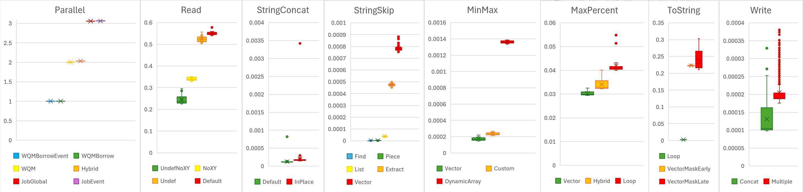
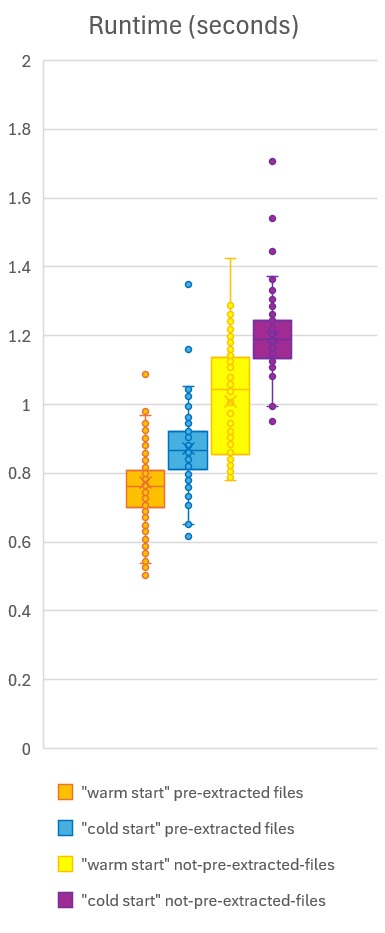

# InterSystems Employee Programming Challenge #1

## Goal

Produce a correct ObjectScript-only\* solution to the challenge, that runs as quickly as possible. 

\* System functions are allowed, but direct use of other languages/libraries/programs (eg. via `$zf`) is not.

## Usage

Clone this repository, and ensure that user id `51773` has write access to `./data/out` and `./data/temp` (eg. by running `sudo chown -R 51773:51773 ./data`).

| Call                                      | Description                                                                | Prerequisites                                                                  |
| ----------------------------------------- | -------------------------------------------------------------------------- | ------------------------------------------------------------------------------ |
| `src/reset-environment.sh`                | Set up the Docker container.                                               | No prerequisites.                                                              |
| `src/test-cold-start.sh (num_iterations)` | Set up the Docker container, import `RunScript.mac`, and run the solution. | No prerequisites.                                                              |
| `src/test-warm-start.sh (num_iterations)` | Import `RunScript.mac` and run the solution.                               | Requires an already-set-up Docker container.                                   |
| `src/iris-session.sh`                     | Open up an IRIS session in the Docker container.                           | Requires an already-set-up Docker container.                                   | 
| - `Do ^RunScript`                         | Run the solution.                                                          | Requires an already-set-up Docker container with `src/RunScript.mac` imported. |             
| - `Do Reload^RunScript`                   | Import a new version of `RunScript.mac` into the IRIS instance.            | Requires an already-set-up Docker container with `src/RunScript.mac` imported. |
| `src/cat-output.sh`                       | Display the the contents of the output files (from `data/out`).            | Requires the solution to have been run, to produce output files.               |

## Approach

I broke down the steps the program needed to take, and benchmarked different solutions to them:
- **Parallel**: Spawn 20 processes and wait for them to complete work
- **Read**: `Read` a `.csv.gz` file with different `open` parameters
- **StringConcat**: Concatenate two long strings
- **StringSkip**: Skip to / extract the the Nth character-delimited substring in a larger string
- **MinMax**: Find min/max values from a string-format decimal array with NaNs (eg. `[1.013,NaN,NaN,8123.412]`)
- **MaxPercent**: Convert two min/max list/vector pairs into a list/vector with the largest `(max-min)/min` value of the two
- **ToString**: Convert multiple lists/vectors into a comma-separated string
- **Write**: `Write` multiple chunks of data to a device

The implementation of those benchmarks can be found in `src/RunScript.mac` (disabled with `#If 0`).
- Individual benchmarks can be run with `Do Benchmark<Name>^RunScript` (eg. `Do BenchmarkRead^RunScript`).
- All benchmarks can be run with `Do Benchmark^RunScript`.

## Runtime statistics

Stats were collected on a Dell Precision 5570 laptop with an i9-12900H CPU, under Docker in WSL on Windows 11.

_To enable / disable pre-extraction of input files, set `#Define PreExtractFiles` to `1` / `0` at the top of `src/RunScript.mac`._

|          | "warm start" pre-extracted files 200 iterations | "cold start" pre-extracted files 100 iterations | "warm start" not-pre-extracted files 200 iterations | "cold start" not-pre-extracted-files 100 iterations |
| -------- | -------------------------------------------------- | -------------------------------------------------- | ------------------------------------------------------ | ------------------------------------------------------ |
| minimum  |                                 `0.503831 seconds` |                                 `0.616695 seconds` |                                     `0.778758 seconds` |                                     `0.949315 seconds` |
| mean     |                                 `0.773311 seconds` |                                 `0.871965 seconds` |                                     `1.008956 seconds` |                                     `1.195569 seconds` |

### Breakdown of a "warm start" + pre-extracted files run

| Section                           | Time                   | % of parent |
| --------------------------------- | ---------------------: | :---------- |
| `Run` ("Elapsed time" only)       | `0.910324 seconds`     | `100.00%`   |
| - Waiting on children to finish   | `0.904862 seconds`     | ` 99.40%`   |
| - Other time                      | `0.005462 seconds`     | `  0.60%`   |

| Section                                     | Average Time       | Average % of parent |
| ------------------------------------------- | -----------------: | :------------------ |
| `RunOnFile` (end at `$System.Event.Signal`) | `0.617868 seconds` | `100.00%`           |
| - Non-initial `Read` commands               | `0.287351 seconds` | ` 46.51%`           |
| - Process line data                         | `0.211859 seconds` | ` 34.29%`           |
| - Concat old + new read data                | `0.066154 seconds` | ` 10.71%`           |
| - Skip to `source_id` in next line          | `0.034226 seconds` | `  5.54%`           |
| - Other time                                | `0.008504 seconds` | `  1.38%`           |
| - Construct and `write` output              | `0.004776 seconds` | `  0.77%`           |
| - Calculate % change                        | `0.004437 seconds` | `  0.72%`           |
| - Initial `Read` command                    | `0.000194 seconds` | `  0.03%`           |
| - Skip commented lines ("#...")             | `0.000194 seconds` | `  0.03%`           |
| - `Open` / `Use` commands                   | `0.000126 seconds` | `  0.02%`           |
| - Signal parent process                     | `0.000047 seconds` | `  0.01%`           |

### Breakdown of a "warm start" + not-pre-extracted files run

| Section                           | Time (seconds)         | % of parent |
| --------------------------------- | ---------------------: | :---------- |
| `Run` ("Elapsed time" only)       | `1.525059 seconds`     | `100.00%`   |
| - Waiting on children to finish   | `1.522190 seconds`     | ` 99.81%`   |
| - Other time                      | `0.002869 seconds`     | `  0.19%`   |

| Section                                     | Average Time       | Average % of parent |
| ------------------------------------------- | -----------------: | :------------------ |
| `RunOnFile` (end at `$System.Event.Signal`) | `0.966073 seconds` | `100.00%`           |
| - Non-initial `Read` commands               | `0.584186 seconds` | ` 60.47%`           |
| - Process line data                         | `0.241709 seconds` | ` 25.02%`           |
| - Concat old + new read data                | `0.081371 seconds` | `  8.42%`           |
| - Skip to `source_id` in next line          | `0.036941 seconds` | `  3.82%`           |
| - Other time                                | `0.009309 seconds` | `  0.96%`           |
| - Construct and `write` output              | `0.005113 seconds` | `  0.53%`           |
| - Initial `Read` command                    | `0.002201 seconds` | `  0.23%`           |
| - Calculate % change                        | `0.004454 seconds` | `  0.46%`           |
| - `Open` / `Use` commands                   | `0.000519 seconds` | `  0.05%`           |
| - Skip commented lines ("#...")             | `0.000205 seconds` | `  0.02%`           |
| - Signal parent process                     | `0.000065 seconds` | `  0.01%`           |

## Untested ideas

- Have processes that finish their work early start "helping" other processes (eg. by reading-ahead in the input file).
  - Or, break up work into smaller chunks.
- Use a group `$vectorOp` to calculate min/max of all `bp_flux` and `rp_flux` fields in a given file at once.
- Don't concatenate old + new read data. Rework processing logic to switch to the new data whenever it hits the end of the old data, instead of expecting to always have a full line available.
- Reduce background process activity / increase IRIS process priority.
  - I don't think there's much time to gain here, because background activity is low. I tried setting a few IRIS switches, but they didn't have much effect on timing.

